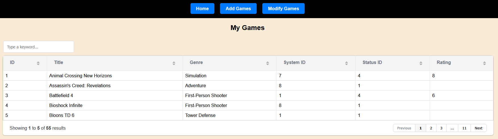
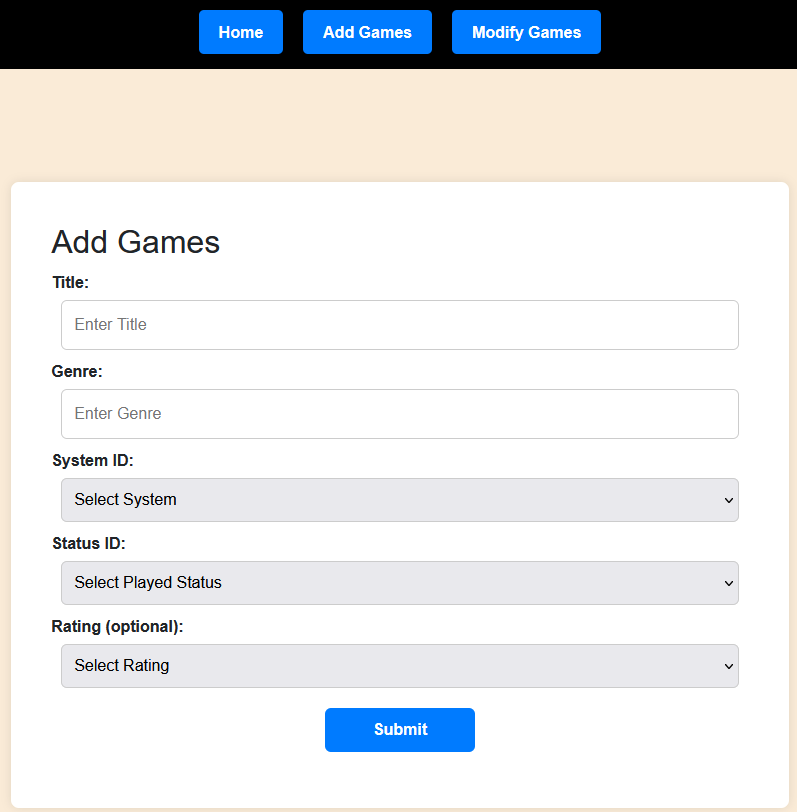
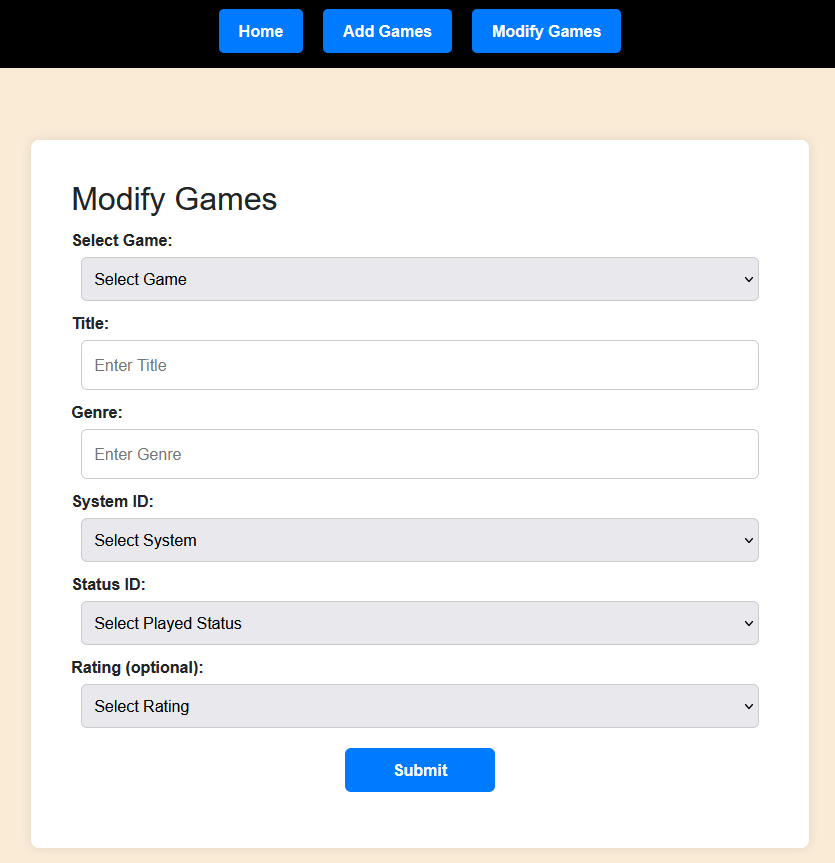

# Game Collection Manager Frontend

# Table of Contents
- [Description](#description)
- [Installation and Setup](#installation-and-setup)
- [Usage](#usage)
- [API Endpoints](#api-endpoints)
- [Contributions](#contributions)
- [License](#license)

# Description
Web-based interface that allows the user to view and manage their personal video game collection. 
It enables users to interact with the Game Collection REST API.

The frontend uses:
- HTML
- CSS
- JavaScript
- Grid.js for viewing and managing data
- Bootstrap for additional style purposes

# Installation and Setup
## Prerequisites
The frontend consists of HTML, CSS, and JavaScript, which can be run directly in a web browser.
It is recommended to use a modern web browser. Alternatively, it can be run locally through Visual Studio Code with the Live Server extension.
## Clone Repository
`git clone https://github.com/jackloomis/game_collection_frontend`
`cd game_collection_frontend`

# Usage
The main `index.html` page displays the following information about each game:
- ID
- Title
- Genre
- System
- Played Status
- User Rating

The Grid.js table supports the following:
- Searching
- Sorting
- Multiple pages
- Column resizing



Additionally, forms are provided to add new games and modify existing games on the `addGames.html` and `modifyGames.html` pages.




# API Endpoints
The frontend uses a REST API hosted on Render to communicate with the backend.
## Base Frontend URL
`https://game-collection-frontend-red9.onrender.com/index.html`
## Base Backend URL
`https://game-collection-backend-arno.onrender.com/api/v1/game_collection`
## Endpoints
- Retrieve games: GET `/api/v1/game_collection`
- Retrieve by ID: GET `/api/v1/game_collection/id/:id`
- Add a new game: POST `/api/v1/game_collection`
- Modify a game: PUT `/api/v1/game_collection/id/:id`
## Example GET Request
The frontend uses JavaScript `fetch()` to retrieve the list of games:

```javascript
const API_URL = "https://game-collection-backend-arno.onrender.com/api/v1/game_collection";

fetch(API_URL)
    .then(response => response.json())
    .then(data => {
    const formattedData = data.map(game => [
        game.id,
        game.title,
        game.genre,
        game.system_id,
        game.status_id,
        game.rating
    ]);
}
```
The JSON data will then be displayed in the Grid.js table.
# Contributions
To contribute:<br>

- Fork repository
- Clone fork locally
- Create and test changes locally
- Commit code with a message describing changes
- Push to `dev` branch on GitHub
- Open pull request

# License
This project is licensed under the MIT open-source license.


